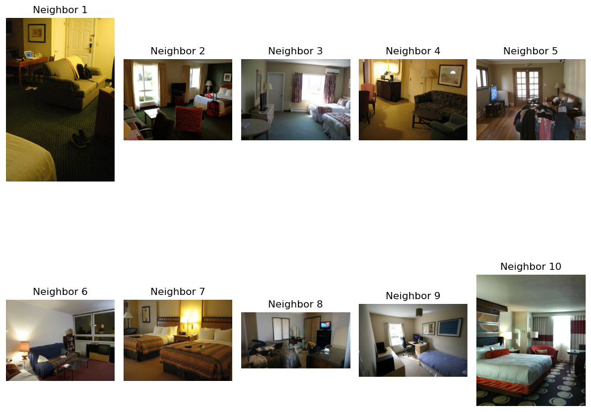
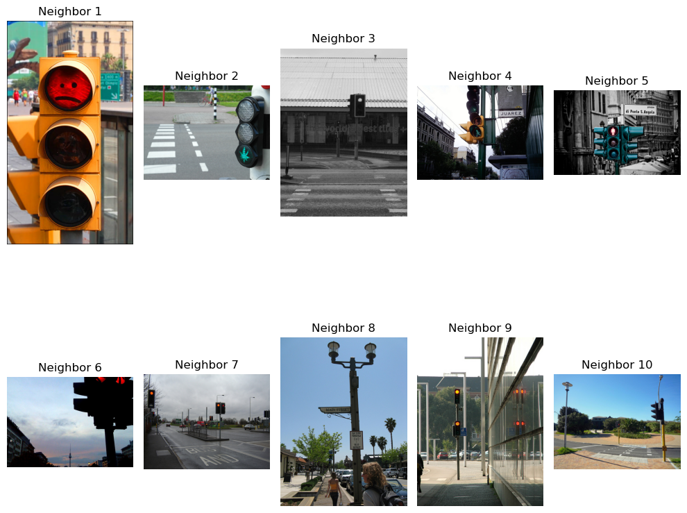

# Cross-Modal Search Assignment

This assignment demonstrates cross-modal search, aligning images and text for retrieval using embeddings and efficient similarity search methods.

## Workflow
1. **Dataset Loading**: 15,000 images with captions, providing a rich dataset for experimentation.
   - Utilizes pre-trained models for accurate embedding generation.
2. **Embedding Generation**: Convert images and text into numerical vectors using pre-trained models.
   - Cross-modal alignment via Canonical Correlation Analysis (CCA) bridges text and image spaces.
3. **Similarity Search**: Implement efficient KNN using KD-Trees and LSH for large-scale data.
   - KD-Tree enables rapid and scalable nearest-neighbor searches.
4. **Cross-Modal Retrieval**: Perform cross-modal searches such as Text-to-Image and Image-to-Text.

## Example Results

### Image-to-Image
**Query:**

**Result:**

---

### Image-to-Text
**Query:**

**Result:**
1. "A living room with a large couch and a couple of windows."
2. "A bed sitting in a bedroom next to a large wall."
3. "A living room filled with furniture and large window."

---

### Text-to-Image
**Query:** *"traffic light"*

**Result:**

---

### Text-to-Text
**Query:** *"traffic light"*

**Result:**
1. "A traffic light hanging from the side of a pole."
2. "A light that is attached to a pole."
3. "A couple of street lights are hanging up over a street."

# Resources used
- https://huggingface.co/docs/datasets/index
- https://huggingface.co/google/vit-base-patch16-224-in21k
- https://huggingface.co/sentence-transformers/all-mpnet-base-v2
- https://www.baeldung.com/cs/k-d-trees
- https://scikit-learn.org/0.16/modules/generated/sklearn.cross_decomposition.CCA.html
